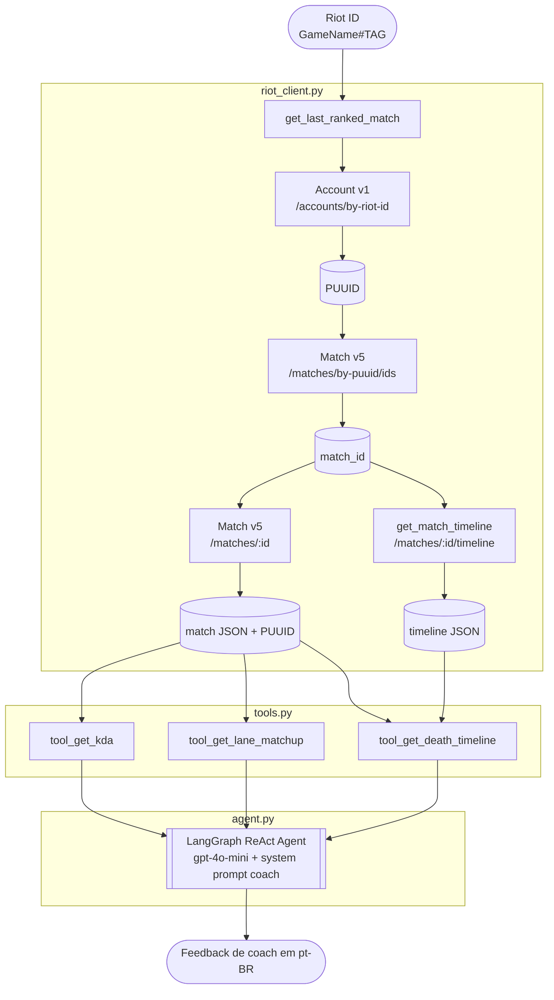

# LoL Match Analyzer


Dado um Riot ID (ex: `Faker#KR1`), o sistema busca a última partida ranqueada, extrai métricas de desempenho e um agente LangGraph retorna **feedback de coach em português**, focado em jogadores de Silver/Gold.

**Problema:** Jogadores de elos baixos têm dificuldade em identificar os próprios erros pós-partida.  
**Solução:** Análise automática via LLM com feedback direto e específico, executado por um agente com ferramentas reais.

---

## Como funciona



---

## Pré-requisitos

- Python 3.11+
- [Chave de API da Riot](https://developer.riotgames.com/) (dura 24h, renovação gratuita)
- Chave de API da OpenAI

---

## Instalação

```bash
git clone https://github.com/seu-usuario/lol-match-analyzer
cd lol-match-analyzer

python -m venv .venv
source .venv/bin/activate  # Windows: .venv\Scripts\activate

pip install -r requirements.txt

cp .env.example .env
# Edite .env com suas chaves
```

---

## Uso

### CLI (recomendado)

```bash
python cli.py "Faker#KR1"
```

Ou interativo:

```bash
python cli.py
# Riot ID (ex: Faker#KR1): Matemático#1689
```

Saída esperada:

```
============================================================
ANÁLISE DO COACH
============================================================
**Resumo da partida**
Você jogou Zed no mid contra Lux e terminou 7/3/5...

**Principal problema desta partida**
...

**O que fazer diferente**
...

**Ponto positivo**
...
============================================================
```

### Uso programático

```python
from src.riot_client import get_last_ranked_match, get_match_timeline
from src.extractors import extract_kda, extract_lane_matchup, extract_death_timeline

match, puuid = get_last_ranked_match("Matemático#1689")
timeline = get_match_timeline(match["metadata"]["matchId"])

print(extract_kda(match, puuid))
# {"kills": 7, "deaths": 3, "assists": 5, "kda_ratio": 4.0}

print(extract_lane_matchup(match, puuid))
# {"champion": "Zed", "position": "MIDDLE", "opponent_champion": "Lux"}

print(extract_death_timeline(match, timeline, puuid))
# [{"timestamp_ms": 321857, "timestamp_min": 5.4, "position": {...}, "killer_id": 6}, ...]
```

---

## Estrutura

```
lol-match-analyzer/
├── src/
│   ├── riot_client.py     # Busca partida e timeline via API da Riot
│   ├── extractors.py      # Extrai KDA, matchup de lane, timeline de mortes
│   ├── tools.py           # Wraps dos extractors como LangChain tools (com cache)
│   └── agent.py           # Agente LangGraph + system prompt de coach Silver/Gold
├── tests/
│   └── test_extractors.py # Testes unitários com respostas mockadas
├── cli.py                 # Entry point — aceita riot_id como argumento ou input
├── .env.example
├── requirements.txt
└── README.md
```

---

## Extratores

### `extract_kda(match, puuid) → dict`
```python
{"kills": 7, "deaths": 3, "assists": 5, "kda_ratio": 4.0}
```

### `extract_lane_matchup(match, puuid) → dict`
```python
{"champion": "Zed", "position": "MIDDLE", "opponent_champion": "Lux"}
```

### `extract_death_timeline(match, timeline, puuid) → list[dict]`
```python
[
  {"timestamp_ms": 321857, "timestamp_min": 5.4, "position": {"x": 1724, "y": 10980}, "killer_id": 6},
  ...
]
```

---

## Agente

O agente usa `langgraph.prebuilt.create_react_agent` com `gpt-4o-mini`. O system prompt define:

- Público-alvo: Silver/Gold
- Interpretação de KDA e mortes por fase do jogo (early/mid/late)
- Avaliação de matchup favorável vs. desfavorável
- Formato fixo de resposta: Resumo → Problema → Solução → Ponto positivo
- Cache in-memory das chamadas à Riot API (evita chamadas duplicadas por sessão)

---

## Testes

```bash
python -m pytest
```

Dois testes unitários mockam a resposta da API da Riot e verificam:
- KDA calculado corretamente (incluindo ratio com deaths=0)
- Timeline de mortes filtra apenas mortes do jogador (ignora mortes de oponentes)

---

## Diagrama conceitual

[Ver no draw.io](https://app.diagrams.net/?src=about#G1TuuHKcZPKMZPk16GINhOsTfruHM2XTQT#%7B%22pageId%22%3A%22VkK2OuwKXaiVj8S8FYke%22%7D)
